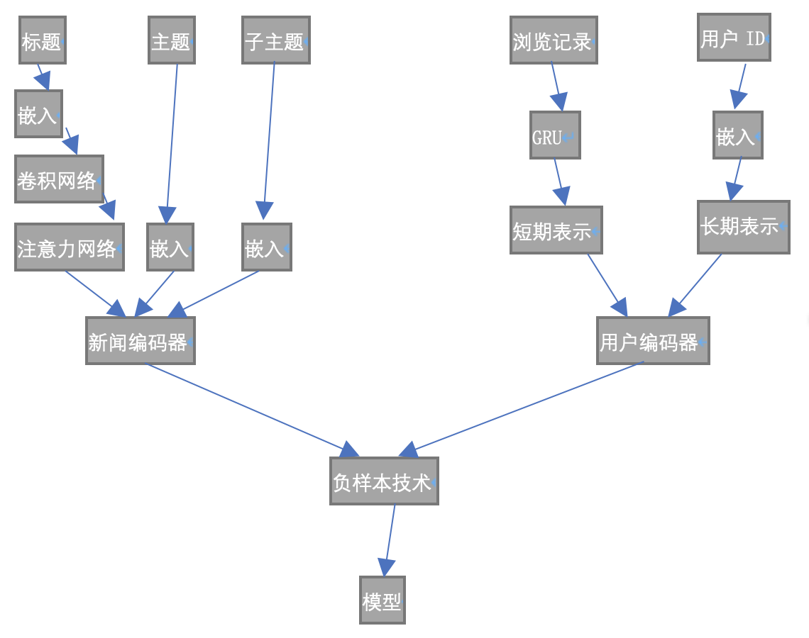

# 机器学习课程实验报告——具有长短期用户表示的新闻推荐

## 第一部分：算法原理介绍

### 1. 背景知识

个性化新闻推荐对于用户寻找他们感兴趣的新闻以及提升阅读体验很重要。新闻推荐中的关键问题是学习准确的用户表示形式以吸引他们的兴趣。用户通常具有长期偏好和短期兴趣。然而，现有的新闻推荐方法通常学习用户的单方面表示，这可能是不够的。在本文中，作者提出了一种新闻推荐方法，该方法可以学习长期和短期的用户表示。方法的核心是新闻编码器和用户编码器。新闻编码器从新闻的标题和主题类别中学习新闻的表示形式，并使用注意网络选择重要的单词。用户编码器从其ID的嵌入中学习长期的用户表示形式，通过GRU网络从他们最近浏览的新闻中学习短期用户表示。另外，作者还提出了两种结合长期和短期用户表示的方法。第一种是用长期用户表示来初始化在短期用户表示中的GRU网络的隐藏状态。第二种是将长期和短期用户表示联系起来作为一个统一的向量。在真实数据集上的大量实验表明，该方法可以有效地改善新闻推荐的性能。

### 2. 算法介绍

算法流程图如下：

详细描述见第二部分。

## 第二部分：算法介绍以及分析

### 1. 新闻编码器

新闻编码器用于从新闻的标题，主题和子主题类别中学习新闻的表示形式。新闻编码器中有两个子模块，即标题编码器和主题编码器。标题编码器用于从标题中学习新闻表示。标题编码器分为三层。第一层是单词嵌入，用于将新闻标题从单词序列转换为密集的语义向量序列。将新闻标题$t$中的单词序列表示为$t=[\omega_1,...,\omega_N]$，其中$N$为标题长度。通过单词嵌入矩阵转换为$[\mathbb{\omega_1,...,\omega_N}]$.

标题编码器的第二层是卷积神经网络（CNN）。通过捕获本地上下文信息来应用CNN网络来学习上下文单词表示。记$\omega_i$的上下文表示为$c_i$，被计算为：
$$
c_i=ReLU(C \times \omega_{[i-M:i+M]}+b)
$$
其中$\omega_{i-M:i+M}$是位置$i-M$和$i+M$之间词嵌入的串联，$C$和$b$是卷积滤波器的参数，$M$是窗口大小。

第三层是注意力网络。同一新闻标题中的不同词在表示新闻时可能具有不同的信息性。采用词级注意力网络来选择新闻标题中的重要词，以了解信息更为丰富的新闻表示形式。第$i$个单词的注意力权重$\alpha_i$被定义为：
$$
a_i=\tanh(v\times c_i+v_b),\alpha_i=\frac{\exp(a_i)}{\sum^N_{j=1}{\exp(a_j)}}
$$
其中$v$和$v_b$是训练参数。新闻标题$t$的最终表示是其上下文单词表示的总和，按其注意力权重加权，如下所示：
$$
e_t=\sum^N_{i=1}{\alpha_ic_i}
$$
主题编码器模块用于从其主题和子主题中学习新闻表示。在许多在线新闻平台（例如MSN新闻）上，新闻文章通常都标有主题类别（例如“体育”）和子主题类别（例如“橄榄球NFL”），以帮助确定用户的兴趣。新闻的主题和子主题类别也有助于学习新闻和用户的表示形式。它们可以揭示新闻的一般主题和详细主题，并反映用户的喜好。为了将主题和子主题信息整合到新闻表示中，建议从ID和ID的嵌入中学习主题和子主题的表示。记$e_v$和$e_{sv}$为主题和子主题的表示，新闻文章的最终表示形式是新闻标题，主题和子主题的表示形式的组合，即$e=[e_t,e_v,e_{sv}]$.

### 2. 用户编码器

用户编码器用于从用户浏览的新闻历史中学习用户的表示形式。它包含两个模块，即用于捕获用户的临时兴趣的短期用户表示模型（STUR），以及用于捕获用户的一致偏好的长期用户表示模型（LTUR）。

#### 2.1 短期用户表示

从最近的浏览历史中了解用户的短期表征，以捕获其时间兴趣，并使用门控循环网络（GRU）网络捕获顺序新闻阅读模式。记一位用户按时间升序排列的新闻浏览顺序为$\mathcal{C}=\{c_1,...,c_k\}$，其中$k$为序列长度。我们应用新闻编码器来获取这些浏览文章的表示，记为$\{e_1,...,e_k\}$. 短期用户表示的计算方式如下：
$$
r_t=\sigma(W_r[h_{t-1},e_t]),\\z_t=\sigma(W_z[h_{t-1},e_t]),\\ \tilde{h}_t=\tanh(W_{\tilde{h}}[r_t\odot h_{t-1},e_t]),\\h_t=z_t\odot \tilde{h}_t+(1-z_t)\odot h_{t-1}
$$
其中$\sigma$是sigmoid函数，$\odot$是逐项乘积，$W_r$，$W_z$和$W_{\tilde{h}}$是GRU网络的参数。短期用户表示是GRU网络的最后隐藏状态，即$u_s = h_k$。

#### 2.2 长期用户表示

长期的用户表示是从用户ID的嵌入中学习的，用户ID的嵌入是在模型训练期间随机初始化和微调的。记u为一个用户的ID，$W_u$为长期用户表示的查询表，该用户的长期用户表示是$u_l=W_u[u]$.

#### 2.3 长短期用户表示组合

采用两种方法来组合长期和短期用户表示形式以实现统一的用户表示形式。第一种方法是使用长期用户表示来初始化短期用户表示模型中的GRU网络的隐藏状态。记这种方式为LSTUR-ini。使用GRU网络的最后一个隐藏状态作为最终的用户表示形式。第二种方法是将长期用户表示与短期用户表示作为最终用户表示进行串联。记这种方式为LSTUR-con。

## 第三部分 实验结果分析

### 1. 评价指标介绍

用基于展示的排名指标来评估效果，包括ROC曲线下的面积（AUC），平均倒数排名（MRR）和标准化的折现累积收益（nDCG）。将每个实验独立重复10次，并以0.95的置信概率报告平均结果。

### 2. 算法性能评估

通过将其与几种基准方法进行比较来评估该方法的性能，包括：

- LibFM，一种最先进的矩阵分解方法，在推荐中广泛使用。在我们的实验中，用户特征是从浏览的新闻标题中提取的TF-IDF特征的串联，以及从浏览的新闻的主题和子主题中归一化的计数特征。新闻的特征包括标题中的TF-IDF特征以及其主题和子主题的one-hot向量。LibFM的输入是用户特征和候选新闻特征的组合。
- DeepFM，一种将分解机和深度神经网络相结合的广泛使用的方法。我们使用与LibFM相同的特征。
- Wide&Deep，结合了广泛渠道和深度渠道的另一种基于深度学习的推荐方法。同样，两个通道都使用与LibFM相同的特征。
- DSSM，深层结构化语义模型。输入是通过字符三字组的哈希词，其中所有已浏览的新闻标题都合并为查询文档。
- CNN，使用具有最大缓冲池的CNN，通过保持最显著的特征来从浏览的新闻标题中学习新闻的表示。
- DKN，一种深度新闻推荐模型，其中包含CNN和对新闻浏览历史记录的候选者注意。
- GRU，通过去噪自动编码器学习新闻表示，并通过GRU网络学习用户表示。

### 3. 模型训练

对于可以预先计算用户和新闻表示形式的在线新闻推荐服务，评分功能应尽可能简单以减少等待时间。使用点积来计算新闻点击概率得分。记用户u的用户表示为$u$，候选新闻$e_x$的表示为$e_x$，该用户点击此新闻的概率得分$s(u，c_x)$计算为$s(u,c_x)=u^{\top}e_x$.

使用负样本技术进行模型训练。对于用户浏览的每条新闻（被视为正样本），我们从相同的印象中随机抽取$K$条未被该用户点击的新闻报道为负样本。将共同预测正面新闻和这$K$个负面新闻的点击概率得分。这样，新闻点击预测问题就被重新表述为伪$K + 1$-分类任务。将训练过程中所有正面样本的负对数似然的总和最小化，可以将其表示为：
$$
\sum^P_{i=1}{log\frac{\exp(s(u,c^p_i))}{\exp(s(u,c^p_i))+\sum^K_{k=1}\exp(s(u,c^n_{i,k}))}}
$$
其中$P$为正训练样本的个数，$c^n_{i,k}$是第$i$个正样本在同一时期第$k$个负样本。

由于并非所有用户都可以参与新闻推荐模型训练（如新来的用户），在预测阶段假设所有用户在模型中都具有长期表示是不合适的。为了解决这个问题，在模型训练阶段，以概率$p$随机掩盖了用户的长期表示。当掩盖长期表示时，所有维都设置为零。因此，LSTUR方法中的长期用户表示可以重新表述为：
$$
u_l=M\cdot W_u[u],M\sim B(1,1-p)
$$
其中$B$为伯努利分布，$M$为服从$B(1,1-p)$的随机变量。在实验中发现，这种用于模型训练的技巧可以提高方法的性能。

在实验中使用了预先训练的GloVe嵌入作为单词嵌入的初始化。单词嵌入维数为200。CNN网络中的过滤器数量为300，CNN网络中的过滤器窗口大小设置为3。将dropout应用于每个图层，以缓解过度拟合的情况。丢失率为0.2。用于模型训练的长期用户表示掩盖概率p的默认值为0.5。使用Adam对该模型进行了优化，学习率为0.01。批次大小设置为400。每个正样本的负样本数为4。

### 4. 运行结果

#### at epoch 1 

train info: logloss 	loss:1.4872970262724172 
eval info: 	group_auc:0.5966, 	mean_mrr:0.2612, 	ndcg@10:0.3488, 	ndcg@5:0.2866 
at epoch 1 , train time: 121.2 	eval time: 14.2

#### at epoch 2 

train info: logloss 	loss:1.403147267153689 
eval info: 	group_auc:0.613, 	mean_mrr:0.275, 	ndcg@10:0.3648, 	ndcg@5:0.3019 
at epoch 2 , train time: 117.7 eval time: 14.3

#### at epoch 3 

train info: logloss 	loss:1.357325366188808 
eval info: 	group_auc:0.6243, 	mean_mrr:0.2817, 	ndcg@10:0.3741, 	ndcg@5:0.31 
at epoch 3 , train time: 117.3 eval time: 14.2

#### at epoch 4 

train info: logloss 	loss:1.320758816890734 
eval info: 	group_auc:0.6239, 	mean_mrr:0.2779, 	ndcg@10:0.3732, 	ndcg@5:0.307 
at epoch 4 , train time: 117.4 eval time: 14.0

#### at epoch 5 

train info: logloss 	loss:1.287604761661526 
eval info: 	group_auc:0.6374, 	mean_mrr:0.297,	 ndcg@10:0.391, 	ndcg@5:0.3262 
at epoch 5 , train time: 117.3 eval time: 14.6

### 5. 结果分析

#### 5.1 长期和短期用户表示的有效性

将LSTUR方法的性能与长期用户表示模型LTUR以及短期用户表示模型STUR进行了比较。比较结果如下：

|           | AUC   | nDCG@10 |
| :-------- | ----- | :------ |
| LTUR      | 0.612 | 0.397   |
| STUR      | 0.628 | 0.408   |
| LSTUR-con | 0.635 | 0.413   |
| LSTUR-ini | 0.636 | 0.414   |

从结果中发现LTUR和STUR都可用于新闻推荐，并且STUR模型可以胜过LTUR模型。使用两种长期和短期用户表示方法（即LSTUR-ini和LSTUR-con）组合STUR和LTUR可以有效地改善性能。该结果证实，结合长期和短期用户表示形式既有助于更准确地捕获各种用户兴趣，也有利于新闻推荐。

#### 5.2 STUR中新闻编码器的有效性

在STUR模型中，GRU用于从最近的浏览新闻中学习短期用户表示。将GRU替换为其他几种编码器，以探索GRU在编码新闻中的有效性，包括：1）平均：使用最近浏览历史的平均数据；2）注意力机制：新闻表示由注意力权重加权得到的总和；3）LSTM，用LSTM取代GRU。结果如下：

|           | AUC   | nDCG@10 |
| --------- | ----- | ------- |
| Average   | 0.631 | 0.411   |
| Attention | 0.631 | 0.411   |
| LSTM      | 0.633 | 0.413   |
| GRU       | 0.635 | 0.414   |

基于序列的编码器（例如，GRU，LSTM）优于基于平均和注意力的编码器,这可能是因为基于序列的编码器可以捕获顺序的新闻阅读模式。GRU的性能优于LSTM，这可能是因为GRU包含较少的参数，过拟合的风险较低。

#### 5.3 新闻标题编码器的有效性

在本文的方法中，新闻编码器是CNN网络和注意力网络的组合（记为CNN + Att）。将其与几个变量，即CNN，LSTM和LSTM+Att进行比较，来验证该方法的有效性。结果如下：

| (AUC)    | LSTUR-ini | LSTUR-con |
| -------- | --------- | --------- |
| LSTM     | 0.626     | 0.621     |
| LSTM+Att | 0.627     | 0.625     |
| CNN      | 0.633     | 0.631     |
| CNN+Att  | 0.636     | 0.635     |

| (nDC@10) | LSTUR-ini | LSTUR-con |
| -------- | --------- | --------- |
| LSTM     | 0.406     | 0.405     |
| LSTM+Att | 0.407     | 0.406     |
| CNN      | 0.409     | 0.411     |
| CNN+Att  | 0.414     | 0.413     |

在基于CNN和LSTM的两种编码器中使用注意机制可以实现更好的性能，这可能是因为注意力网络可以选择重要的单词。使用CNN的编码器优于使用LSTM的编码器，这可能是因为新闻标题中的上下文对于学习新闻表示更加重要。

## 第四部分 实验报告总结与留存问题讨论

在本文的新闻推荐方法中可以学习长期和短期的用户表示形式。模型的核心是新闻编码器和用户编码器。在新闻编码器中，我们从新闻的标题和主题类别中学习新闻的表示形式，并使用注意网络突出显示重要的单词，以进行有益的表示形式学习。在用户编码器中，从用户ID的嵌入中学习用户的长期表示。另外，通过GRU网络从用户最近浏览的新闻中学习用户的短期表示。此外，文章提出了两种融合长期和短期用户表示的方法，即使用长期用户表示在短期用户表示中初始化GRU网络的隐藏状态，或将长期和短期两者并置作为统一的用户向量。实验结果表明该方法可以提高新闻推荐的效果。

对于新闻主题的有效性以及掩蔽概率的影响在实验过程中尚未找到合适的方法进行比较。目前数据集的规模有限，与真实的新闻推荐仍然可能存在一定的差距。